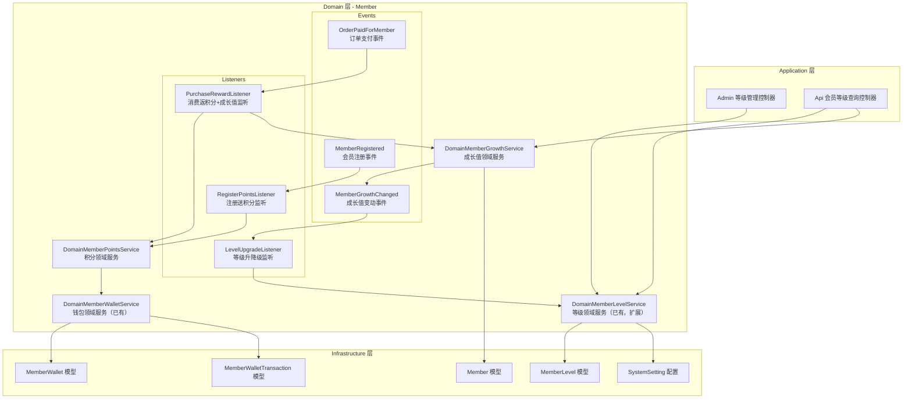
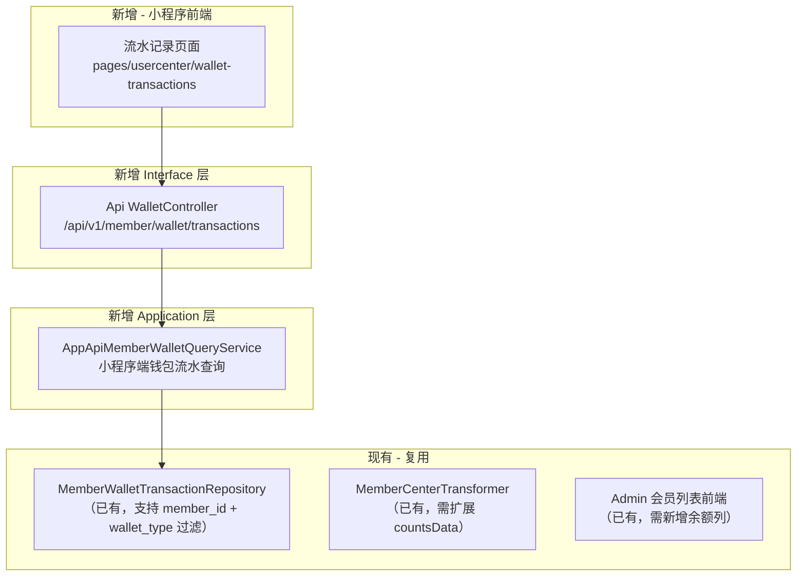

# 设计文档：会员VIP等级体系

## 概述

本设计基于现有的 Member 领域（DDD 架构）扩展会员VIP等级体系功能。系统已具备 `MemberLevel` 模型（含 growth_value_min/max、discount_rate、point_rate、privileges 等字段）、`MemberWallet` 积分钱包（type=points）、`MemberWalletTransaction` 流水记录以及 `MemberSetting` 系统配置值对象。

核心设计思路：
- 利用已有的 `MemberLevel` 表和 `member_levels` 数据库表存储等级定义
- 利用已有的 `MemberWallet`（type=points）管理积分余额
- 通过领域事件（Event/Listener）解耦成长值变动、等级升降级、积分发放等流程
- 通过 `DomainMallSettingService` 读取系统配置（注册积分、积分比率等）

## 架构



## 组件与接口

### 1. DomainMemberGrowthService（成长值领域服务）

新增服务，负责成长值的增减和等级重算触发。

```php
final class DomainMemberGrowthService
{
    public function __construct(
        private readonly MemberRepository $memberRepository,
        private readonly DomainMemberLevelService $levelService,
    ) {}

    /**
     * 增加成长值
     * @param int $memberId 会员ID
     * @param int $amount 成长值增量（正整数）
     * @param string $source 来源（如 'order_payment', 'sign_in'）
     * @param string $remark 备注
     */
    public function addGrowthValue(int $memberId, int $amount, string $source, string $remark = ''): void;

    /**
     * 减少成长值
     * @param int $memberId 会员ID
     * @param int $amount 成长值减量（正整数）
     * @param string $source 来源（如 'order_refund'）
     * @param string $remark 备注
     */
    public function deductGrowthValue(int $memberId, int $amount, string $source, string $remark = ''): void;

    /**
     * 根据当前成长值重新计算并更新会员等级
     */
    public function recalculateLevel(int $memberId): void;
}
```

### 2. DomainMemberPointsService（积分领域服务）

新增服务，封装积分发放逻辑，内部调用已有的 `DomainMemberWalletService`。

```php
final class DomainMemberPointsService
{
    public function __construct(
        private readonly DomainMemberWalletService $walletService,
        private readonly DomainMallSettingService $mallSettingService,
        private readonly MemberRepository $memberRepository,
        private readonly MemberLevelRepository $levelRepository,
    ) {}

    /**
     * 注册赠送积分
     */
    public function grantRegisterPoints(int $memberId): void;

    /**
     * 消费返积分
     * @param int $memberId 会员ID
     * @param int $payAmountCents 实付金额（单位：分）
     * @param string $orderNo 订单号
     */
    public function grantPurchasePoints(int $memberId, int $payAmountCents, string $orderNo): void;

    /**
     * 扣回消费返积分（退款场景）
     * @param int $memberId 会员ID
     * @param int $pointsToDeduct 需扣回的积分数
     * @param string $orderNo 订单号
     */
    public function deductPurchasePoints(int $memberId, int $pointsToDeduct, string $orderNo): void;

    /**
     * 计算消费返积分数量
     * @param int $payAmountCents 实付金额（分）
     * @param float $pointRate 等级积分倍率
     * @return int 返还积分数（向下取整）
     */
    public function calculatePurchasePoints(int $payAmountCents, float $pointRate): int;
}
```

### 3. DomainMemberLevelService（等级领域服务 - 扩展）

在已有服务基础上增加等级配置校验和等级匹配方法。

```php
// 新增方法
final class DomainMemberLevelService
{
    /**
     * 根据成长值匹配对应等级
     * @param int $growthValue 当前成长值
     * @return MemberLevel 匹配的等级
     */
    public function matchLevelByGrowthValue(int $growthValue): MemberLevel;

    /**
     * 校验等级配置列表的合法性（成长值门槛递增、序号唯一）
     * @param array $levels 等级配置数组
     * @throws BusinessException 校验失败时抛出
     */
    public function validateLevelConfigs(array $levels): void;

    /**
     * 获取所有启用的等级列表（按等级序号升序）
     * @return MemberLevel[]
     */
    public function getActiveLevels(): array;
}
```

### 4. 领域事件

```php
// 成长值变动事件
final class MemberGrowthChanged
{
    public function __construct(
        public readonly int $memberId,
        public readonly int $beforeValue,
        public readonly int $afterValue,
        public readonly int $changeAmount,
        public readonly string $source,
        public readonly string $remark = '',
    ) {}
}

// 会员注册事件
final class MemberRegistered
{
    public function __construct(
        public readonly int $memberId,
        public readonly string $source,
    ) {}
}

// 订单支付事件（面向会员积分/成长值）
final class OrderPaidForMember
{
    public function __construct(
        public readonly int $memberId,
        public readonly string $orderNo,
        public readonly int $payAmountCents,
    ) {}
}
```

### 5. 事件监听器

```php
// 等级升降级监听器
final class LevelUpgradeListener implements ListenerInterface
{
    // 监听 MemberGrowthChanged 事件
    // 调用 DomainMemberLevelService::matchLevelByGrowthValue()
    // 如果等级发生变化，更新 Member 的 level 和 level_id
}

// 注册送积分监听器
final class RegisterPointsListener implements ListenerInterface
{
    // 监听 MemberRegistered 事件
    // 调用 DomainMemberPointsService::grantRegisterPoints()
}

// 消费返积分+成长值监听器
final class PurchaseRewardListener implements ListenerInterface
{
    // 监听 OrderPaidForMember 事件
    // 调用 DomainMemberPointsService::grantPurchasePoints()
    // 调用 DomainMemberGrowthService::addGrowthValue()
}
```

## 数据模型

### 现有表结构（无需修改）

**member_levels 表**（已有，字段完整）：
| 字段 | 类型 | 说明 |
|------|------|------|
| id | int | 主键 |
| name | string | 等级名称 |
| level | int | 等级序号 |
| growth_value_min | int | 成长值下限 |
| growth_value_max | int/null | 成长值上限 |
| discount_rate | decimal(8,2) | 折扣率 |
| point_rate | decimal(8,2) | 积分倍率 |
| privileges | json/null | 权益配置 |
| icon | string/null | 等级图标 |
| color | string/null | 等级颜色 |
| status | string | 状态（active/inactive） |
| sort_order | int | 排序 |
| description | string/null | 描述 |

**members 表**（已有相关字段）：
| 字段 | 类型 | 说明 |
|------|------|------|
| level | string | 等级标识 |
| level_id | int/null | 关联 member_levels.id |
| growth_value | int | 当前成长值 |

**wallets 表**（已有，type=points 为积分钱包）：
| 字段 | 类型 | 说明 |
|------|------|------|
| member_id | int | 会员ID |
| type | string | 钱包类型（balance/points） |
| balance | int | 当前余额 |
| frozen_balance | int | 冻结余额 |
| total_recharge | int | 累计充值 |
| total_consume | int | 累计消费 |

**wallet_transactions 表**（已有，记录积分流水）：
| 字段 | 类型 | 说明 |
|------|------|------|
| wallet_id | int | 钱包ID |
| member_id | int | 会员ID |
| wallet_type | string | 钱包类型 |
| type | string | 交易类型 |
| amount | int | 变动金额 |
| balance_before | int | 变动前余额 |
| balance_after | int | 变动后余额 |
| source | string | 来源 |
| related_type | string/null | 关联类型 |
| related_id | int/null | 关联ID |
| description | string/null | 描述 |

### 新增表：member_growth_logs（成长值变动日志）

| 字段 | 类型 | 说明 |
|------|------|------|
| id | bigint | 主键 |
| member_id | int | 会员ID |
| before_value | int | 变动前成长值 |
| after_value | int | 变动后成长值 |
| change_amount | int | 变动值（正为增加，负为减少） |
| source | string | 来源（order_payment/order_refund/sign_in/admin_adjust） |
| related_type | string/null | 关联类型（如 order） |
| related_id | int/null | 关联ID |
| remark | string/null | 备注 |
| created_at | timestamp | 创建时间 |

### 系统配置项（已有，通过 mall.php 定义）

| 配置键 | 类型 | 默认值 | 说明 |
|--------|------|--------|------|
| mall.member.enable_growth | boolean | true | 是否启用成长值 |
| mall.member.register_points | integer | 100 | 注册赠送积分 |
| mall.member.points_ratio | integer | 100 | 每消费1元获得的基础积分数 |
| mall.member.default_level | integer | 1 | 默认等级ID |
| mall.member.vip_levels | json | [...] | VIP等级定义 |
| mall.member.sign_in_reward | integer | 5 | 签到奖励积分 |
| mall.member.invite_reward | integer | 50 | 邀请奖励积分 |
| mall.member.points_expire_months | integer | 24 | 积分有效期（月） |


## 需求 8-10 扩展设计：余额积分展示与流水查询

### 架构扩展



### 组件设计

#### 1. 后台会员列表余额列（需求 8）

现状分析：
- `MemberRepository::handleItems()` 已加载 `wallet` 和 `pointsWallet` 关联
- 前端 `MemberVo` 接口已定义 `wallet?: MemberWallet | null`
- 会员列表已有"积分"列，但缺少"余额"列

改动方案：
- 前端 `web/src/modules/member/views/list/index.vue`：在"积分"列前新增"余额"列
- 余额列使用 `formatYuan(row.wallet?.balance)` 格式化显示（已有 `formatYuan` 工具函数）
- 无需后端改动，数据已通过 wallet 关联返回

```vue
<!-- 新增余额列，插入在"积分"列之前 -->
<el-table-column label="余额" width="120">
  <template #default="{ row }">
    ¥{{ formatYuan(row.wallet?.balance) }}
  </template>
</el-table-column>
```

#### 2. 小程序个人中心余额积分展示（需求 9）

现状分析：
- `MemberCenterTransformer` 已在 `userInfo` 中返回 `balance` 和 `points`
- `countsData` 当前只有"积分"和"优惠券"两项
- 小程序 `index.js` 中"我的余额"菜单点击显示"开发中" toast

改动方案：
- 后端 `MemberCenterTransformer`：在 `countsData` 数组开头插入余额数据项
- 小程序 `index.js`：为余额和积分的点击事件添加页面跳转逻辑
- 小程序 `index.wxml`：countsData 区域的数据项支持点击跳转

```php
// MemberCenterTransformer 扩展 countsData
'countsData' => [
    [
        'num' => $profile['balance'] ?? 0,
        'name' => '余额',
        'type' => 'balance',
    ],
    [
        'num' => $profile['points'],
        'name' => '积分',
        'type' => 'point',
    ],
    [
        'num' => $couponCount,
        'name' => '优惠券',
        'type' => 'coupon',
    ],
],
```

小程序端点击跳转逻辑：
- 点击余额 → `wx.navigateTo({ url: '/pages/usercenter/wallet-transactions/index?type=balance' })`
- 点击积分 → `wx.navigateTo({ url: '/pages/usercenter/wallet-transactions/index?type=points' })`

#### 3. 流水记录查询 API（需求 10）

新增面向小程序端的流水查询接口，复用已有的 `MemberWalletTransactionRepository`。

```php
// 新增 Application 层服务
final class AppApiMemberWalletQueryService
{
    public function __construct(
        private readonly MemberWalletTransactionRepository $repository,
    ) {}

    /**
     * 查询会员钱包流水（分页）
     * @param int $memberId 当前登录会员ID
     * @param string $walletType 钱包类型（balance/points）
     * @param int $page 页码
     * @param int $pageSize 每页条数
     * @return array{list: array, total: int}
     */
    public function transactions(int $memberId, string $walletType, int $page, int $pageSize): array
    {
        return $this->repository->page(
            ['member_id' => $memberId, 'wallet_type' => $walletType],
            $page,
            $pageSize
        );
    }
}
```

```php
// 新增 API 控制器
#[Controller(prefix: '/api/v1/member/wallet')]
#[Middleware(TokenMiddleware::class)]
final class WalletController extends AbstractController
{
    #[GetMapping(path: 'transactions')]
    public function transactions(WalletTransactionRequest $request): Result
    {
        $payload = $request->validated();
        return $this->success(
            $this->walletQueryService->transactions(
                $this->currentMember->id(),
                $payload['wallet_type'],
                (int) ($payload['page'] ?? 1),
                (int) ($payload['page_size'] ?? 20),
            )
        );
    }
}
```

请求参数校验：
- `wallet_type`：必填，枚举值 `balance` 或 `points`
- `page`：可选，默认 1
- `page_size`：可选，默认 20

#### 4. 小程序流水记录页面（需求 10）

新增页面 `pages/usercenter/wallet-transactions/index`：
- 通过 URL 参数 `type` 区分余额流水和积分流水
- 页面标题根据类型动态设置（"余额明细" / "积分明细"）
- 列表项展示：变动类型标签、金额（+/-前缀）、来源描述、时间
- 支持下拉刷新（`onPullDownRefresh`）和触底加载（`onReachBottom`）

## 正确性属性（Correctness Properties）

*属性（Property）是指在系统所有合法执行路径中都应成立的特征或行为——本质上是对系统应做之事的形式化陈述。属性是人类可读规格说明与机器可验证正确性保证之间的桥梁。*

### Property 1: 等级配置校验——序号唯一且成长值门槛严格递增

*For any* 等级配置列表，按等级序号排序后，每个等级的序号必须唯一，且每个等级的 `growth_value_min` 必须严格大于前一个等级的 `growth_value_min`。

**Validates: Requirements 1.2, 1.3, 1.5**

### Property 2: 等级列表查询排序

*For any* 存储在数据库中的等级集合，调用等级列表查询接口返回的结果必须按等级序号（`level`）升序排列。

**Validates: Requirements 1.6**

### Property 3: 成长值与等级匹配

*For any* 成长值和等级配置列表，`matchLevelByGrowthValue(growthValue)` 返回的等级必须是所有 `growth_value_min <= growthValue` 的等级中等级序号最大的那个。此属性同时覆盖升级和降级场景。

**Validates: Requirements 2.3, 2.4**

### Property 4: 成长值变动日志完整性

*For any* 成长值变动操作（增加或减少），系统必须在 `member_growth_logs` 表中创建一条记录，且该记录的 `after_value` 等于 `before_value + change_amount`，`after_value` 等于会员当前的 `growth_value`。

**Validates: Requirements 2.5**

### Property 5: 积分余额非负不变量

*For any* 积分钱包和任意操作序列（增加、扣减），积分余额在任何时刻均为非负整数。当扣减金额大于当前余额时，操作必须被拒绝。

**Validates: Requirements 3.3, 3.5**

### Property 6: 积分流水记录一致性

*For any* 积分变动操作，系统必须创建一条 `wallet_transactions` 记录，且 `balance_after` 等于 `balance_before + amount`（增加时 amount 为正，扣减时 amount 为负的绝对值记录在 amount 字段，type 区分方向）。

**Validates: Requirements 3.2**

### Property 7: 注册赠送积分正确性

*For any* 新注册会员，当系统配置的 `register_points > 0` 时，该会员的积分钱包余额应增加 `register_points` 数量的积分。

**Validates: Requirements 4.2**

### Property 8: 注册赠送积分幂等性

*For any* 会员，多次调用注册赠送积分方法，积分钱包中来源为"注册赠送"的流水记录最多只有一条。

**Validates: Requirements 4.5**

### Property 9: 消费返积分计算公式

*For any* 实付金额（单位：分）`payAmountCents`、系统积分比率 `pointsRatio` 和等级积分倍率 `pointRate`，计算结果必须等于 `floor(payAmountCents / 100 * pointsRatio * pointRate)`。

**Validates: Requirements 5.2, 5.4, 6.2**

### Property 10: 退款扣回积分

*For any* 已完成消费返积分的订单，当该订单全额退款时，之前发放的消费返还积分必须被扣回。

**Validates: Requirements 6.5**

### Property 11: 下一等级差值计算

*For any* 会员的当前成长值和等级配置列表，如果存在更高等级，则返回的差值必须等于下一等级的 `growth_value_min` 减去当前成长值；如果已是最高等级，则差值为 0。

**Validates: Requirements 7.3**

### Property 12: 余额格式化——分转元保留两位小数

*For any* 非负整数余额值（单位：分），格式化为元后的结果必须等于 `(余额 / 100).toFixed(2)`，即保留两位小数的字符串表示。

**Validates: Requirements 8.1, 9.3**

### Property 13: 流水记录过滤正确性

*For any* 会员ID和钱包类型（balance 或 points），调用流水查询 API 返回的所有记录的 `member_id` 必须等于请求的会员ID，且 `wallet_type` 必须等于请求的钱包类型。

**Validates: Requirements 10.1**

### Property 14: 流水记录时间倒序

*For any* 流水查询 API 返回的记录列表，列表中每条记录的 `created_at` 必须大于等于其后一条记录的 `created_at`。

**Validates: Requirements 10.2**

### Property 15: 流水记录字段完整性

*For any* 流水查询 API 返回的记录，每条记录必须包含 `type`（变动类型）、`amount`（变动金额）、`balance_before`（变动前余额）、`balance_after`（变动后余额）、`source`（来源）和 `created_at`（创建时间）字段，且均不为 null。

**Validates: Requirements 10.3**

### Property 16: 流水金额符号格式化

*For any* 流水记录的变动金额，当金额为正数时展示文本必须以 "+" 为前缀，当金额为负数时展示文本必须以 "-" 为前缀。

**Validates: Requirements 10.5**

## 错误处理

| 场景 | 处理方式 |
|------|----------|
| 等级配置校验失败（序号重复/门槛逆序） | 抛出 `BusinessException`，返回具体校验错误信息 |
| 积分扣减余额不足 | 抛出 `BusinessException`，提示"余额不足，当前余额：{balance}" |
| 成长值变动值为零 | 忽略操作，不产生日志 |
| 会员不存在 | 抛出 `BusinessException`，返回 NOT_FOUND |
| 等级匹配无结果（无启用等级） | 使用系统默认等级（`mall.member.default_level`） |
| 注册积分配置为零 | 跳过积分赠送，不产生流水 |
| 消费返积分计算结果为零 | 跳过积分发放，不产生流水 |
| 退款扣回积分时余额不足 | 扣减至零，记录实际扣减数量 |
| 流水查询钱包类型参数缺失或无效 | 返回 422 参数校验错误，提示"wallet_type 必须为 balance 或 points" |
| 流水查询会员未登录 | 返回 401 未授权错误 |

## 测试策略

### 单元测试

- 等级配置校验逻辑（`validateLevelConfigs`）：测试合法配置、重复序号、门槛逆序等边界情况
- 消费返积分计算（`calculatePurchasePoints`）：测试各种金额、比率组合，特别是小数截断
- 成长值等级匹配（`matchLevelByGrowthValue`）：测试边界值（恰好等于门槛、介于两个等级之间）
- 下一等级差值计算：测试最高等级、最低等级、中间等级
- 余额格式化（`formatYuan`）：测试 0、1、99、100、12345 等典型值的分转元格式化
- 流水查询 API 参数校验：测试缺失 wallet_type、无效 wallet_type 值的错误响应
- 流水金额符号格式化：测试正数、负数、零值的显示前缀

### 属性测试（Property-Based Testing）

使用 **PhpQuickCheck**（`steos/quickcheck`）或 **Eris**（`giorgiosironi/eris`）作为 PHP 属性测试库。

每个属性测试至少运行 100 次迭代。每个测试用注释标注对应的设计属性编号：

```php
// Feature: member-vip-level, Property 1: 等级配置校验——序号唯一且成长值门槛严格递增
// Feature: member-vip-level, Property 3: 成长值与等级匹配
// Feature: member-vip-level, Property 5: 积分余额非负不变量
// Feature: member-vip-level, Property 9: 消费返积分计算公式
// Feature: member-vip-level, Property 12: 余额格式化——分转元保留两位小数
// Feature: member-vip-level, Property 13: 流水记录过滤正确性
// Feature: member-vip-level, Property 14: 流水记录时间倒序
```

### 测试分工

- **单元测试**：覆盖具体示例、边界条件、错误场景
- **属性测试**：覆盖通用属性，通过随机输入验证公式正确性、不变量保持、幂等性等
- 两者互补：单元测试捕获具体 bug，属性测试验证通用正确性
