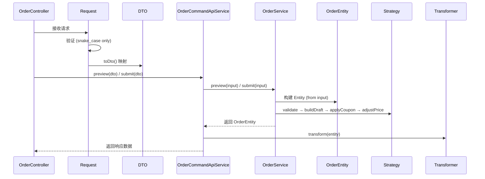
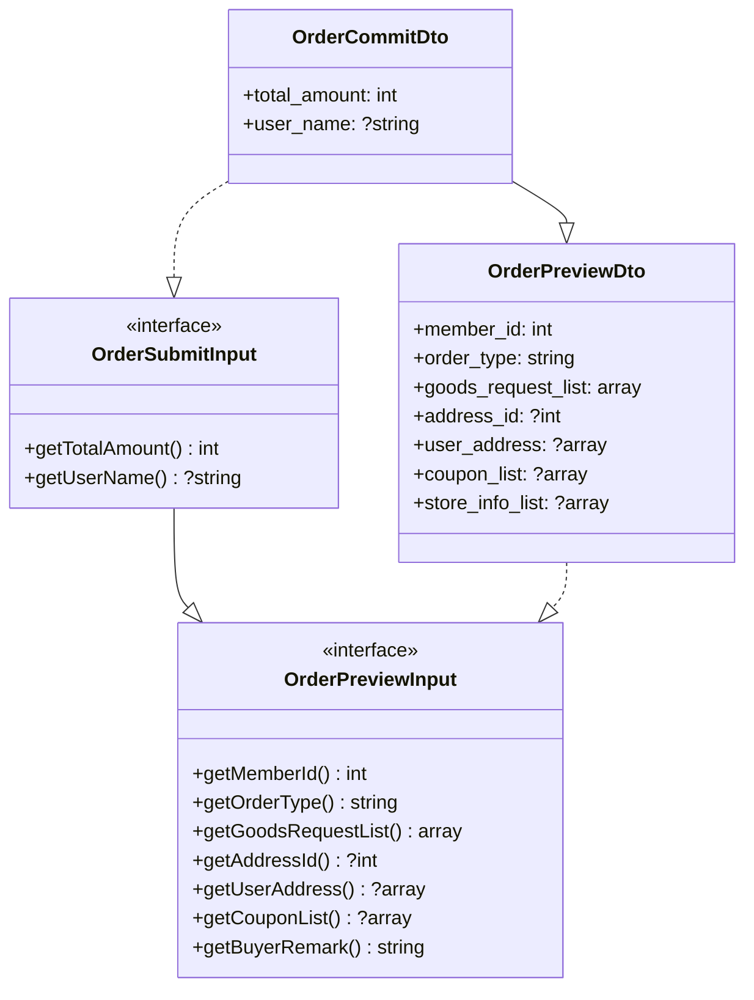

# 设计文档：订单结算 DDD 重构

## 概述

本设计对订单预览（preview）和提交（submit）流程进行 DDD 架构重构。核心改动包括：

1. **Bug 修复**：修复 preview 方法签名错误、payByBalance 支付方式覆盖、submit 中 buildDraft 与库存扣减顺序问题
2. **DDD 合规**：补全 Contract → DTO → Request::toDto() 链路，消除 OrderPayloadFactory 中的领域逻辑
3. **API 字段标准**：移除所有 camelCase 兼容映射
4. **扩展性**：策略工厂自动注册、策略接口增加 adjustPrice/applyCoupon 钩子
5. **增强**：价格校验、优惠券折扣计算与核销、OrderCreatedEvent 监听器
6. **小程序适配**：优惠券选择组件对接真实 API、下单参数 snake_case 适配

## 架构

重构后的调用链路严格遵循 DDD-ARCHITECTURE.md 规范：



### 分层职责

| 层 | 组件 | 职责 |
|---|---|---|
| Interface | Request | 验证入参（snake_case），toDto() 映射 |
| Interface | DTO | 实现 Domain Contract，携带数据 |
| Application | OrderCommandApiService | 事务管理、事件发布、调用领域服务 |
| Application | OrderCheckoutTransformer | 将 Entity 转换为前端响应格式 |
| Domain | OrderService | 业务编排：构建 Entity、调用策略管线、库存、持久化 |
| Domain | OrderEntity | 聚合根，行为方法：initFromInput()、syncPriceDetailFromItems() |
| Domain | Strategy | validate → buildDraft → applyCoupon → adjustPrice |
| Domain | OrderTypeStrategyFactory | 自动注册策略，按 type 分发 |

## 组件与接口

### 1. Domain Contract 接口

```php
// app/Domain/Order/Contract/OrderPreviewInput.php
interface OrderPreviewInput
{
    public function getMemberId(): int;
    public function getOrderType(): string;
    /** @return array<int, array{sku_id: int, quantity: int}> */
    public function getGoodsRequestList(): array;
    public function getAddressId(): ?int;
    /** @return ?array<string, mixed> */
    public function getUserAddress(): ?array;
    /** @return ?array<int, array{coupon_id: int}> */
    public function getCouponList(): ?array;
    public function getBuyerRemark(): string;
}
```

```php
// app/Domain/Order/Contract/OrderSubmitInput.php
interface OrderSubmitInput extends OrderPreviewInput
{
    public function getTotalAmount(): int;  // 前端传入的总金额（分）
    public function getUserName(): ?string;
}
```

### 2. Interface DTO

```php
// app/Interface/Api/DTO/Order/OrderPreviewDto.php
class OrderPreviewDto implements OrderPreviewInput
{
    public int $member_id = 0;
    public string $order_type = 'normal';
    public array $goods_request_list = [];
    public ?int $address_id = null;
    public ?array $user_address = null;
    public ?array $coupon_list = null;
    public ?array $store_info_list = null;

    // getter 方法实现 OrderPreviewInput
    // getBuyerRemark() 从 store_info_list 提取 remark
}
```

```php
// app/Interface/Api/DTO/Order/OrderCommitDto.php
class OrderCommitDto extends OrderPreviewDto implements OrderSubmitInput
{
    public int $total_amount = 0;
    public ?string $user_name = null;

    // getter 方法实现 OrderSubmitInput
}
```

### 3. Request::toDto()

```php
// OrderPreviewRequest - 移除 prepareForValidation()
public function toDto(int $memberId): OrderPreviewInput
{
    $dto = new OrderPreviewDto();
    $params = $this->validated();
    $dto->member_id = $memberId;
    $dto->order_type = $params['order_type'] ?? 'normal';
    $dto->goods_request_list = $params['goods_request_list'];
    $dto->address_id = $params['address_id'] ?? null;
    $dto->user_address = $params['user_address'] ?? null;
    $dto->coupon_list = $params['coupon_list'] ?? null;
    $dto->store_info_list = $params['store_info_list'] ?? null;
    return $dto;
}
```

```php
// OrderCommitRequest
public function toDto(int $memberId): OrderSubmitInput
{
    $dto = new OrderCommitDto();
    $params = $this->validated();
    $dto->member_id = $memberId;
    $dto->order_type = $params['order_type'];
    $dto->goods_request_list = $params['goods_request_list'];
    $dto->address_id = $params['address_id'] ?? null;
    $dto->user_address = $params['user_address'] ?? null;
    $dto->coupon_list = $params['coupon_list'] ?? null;
    $dto->store_info_list = $params['store_info_list'] ?? null;
    $dto->total_amount = $params['total_amount'];
    $dto->user_name = $params['user_name'] ?? null;
    return $dto;
}
```

### 4. Controller 改造

```php
// OrderController
public function preview(OrderPreviewRequest $request): Result
{
    $data = $this->checkoutService->preview($request->toDto($this->currentMember->id()));
    return $this->success($data, '订单预览');
}

public function submit(OrderCommitRequest $request): Result
{
    $data = $this->checkoutService->submit($request->toDto($this->currentMember->id()));
    return $this->success($data, '下单成功');
}
```

### 5. OrderCommandApiService 改造

```php
// 移除 OrderPayloadFactory 依赖
public function preview(OrderPreviewInput $input): array
{
    $draft = $this->orderService->preview($input);
    return $this->transformer->transform($draft);
}

public function submit(OrderSubmitInput $input): array
{
    $orderEntity = Db::transaction(fn () => $this->orderService->submit($input));
    event(new OrderCreatedEvent($orderEntity));
    return [ /* 响应结构 */ ];
}
```

### 6. OrderService 改造

```php
// preview - 接收 Contract 而非 Entity
public function preview(OrderPreviewInput $input): OrderEntity
{
    $entity = $this->buildEntityFromInput($input);
    $entity->guardPreorderAllowed($this->mallSettingService->product()->allowPreorder());
    $strategy = $this->strategyFactory->make($entity->getOrderType());
    $strategy->validate($entity);
    $strategy->buildDraft($entity);
    $strategy->applyCoupon($entity, $input->getCouponList() ?? []);
    $strategy->adjustPrice($entity);
    return $entity;
}

// submit - 先 buildDraft 再扣库存（修复顺序 Bug）
public function submit(OrderSubmitInput $input): OrderEntity
{
    $entity = $this->buildEntityFromInput($input);
    $entity->guardPreorderAllowed($this->mallSettingService->product()->allowPreorder());
    $entity->applySubmissionPolicy($this->mallSettingService->order());
    $strategy = $this->strategyFactory->make($entity->getOrderType());
    $strategy->validate($entity);
    // 先 buildDraft（校验商品状态），再扣库存
    $strategy->buildDraft($entity);
    $strategy->applyCoupon($entity, $input->getCouponList() ?? []);
    $strategy->adjustPrice($entity);
    // 价格校验
    $entity->verifyPrice($input->getTotalAmount());
    // 库存扣减
    $items = array_map(fn ($item) => $item->toArray(), $entity->getItems());
    $locks = $this->stockService->acquireLocks($items);
    try {
        $this->stockService->reserve($items);
        try {
            $entity = $this->repository->save($entity);
            // 标记优惠券已使用
            $this->markCouponsUsed($entity);
            $strategy->postCreate($entity);
        } catch (\Throwable $e) {
            $this->stockService->rollback($items);
            throw $e;
        }
    } finally {
        $this->stockService->releaseLocks($locks);
    }
    return $entity;
}

// 标记订单关联的优惠券为已使用
private function markCouponsUsed(OrderEntity $entity): void
{
    $couponUserIds = $entity->getAppliedCouponUserIds();
    if (empty($couponUserIds)) return;
    foreach ($couponUserIds as $couponUserId) {
        $couponUserEntity = $this->couponUserService->getEntity($couponUserId);
        $this->couponUserService->markUsed($couponUserEntity, $entity->getId());
    }
}

// 从 Input 构建 Entity（原 PayloadFactory 逻辑下沉到领域层）
private function buildEntityFromInput(OrderPreviewInput $input): OrderEntity
{
    $entity = OrderMapper::getNewEntity();
    $entity->initFromInput($input);
    // 地址解析
    $address = $this->resolveAddress($input);
    if ($address) {
        $entity->setAddress($address);
    }
    return $entity;
}

private function resolveAddress(OrderPreviewInput $input): ?OrderAddressValue
{
    if ($input->getUserAddress()) {
        return OrderAddressValue::fromArray($input->getUserAddress());
    }
    if ($input->getAddressId()) {
        $detail = $this->addressService->detail($input->getMemberId(), $input->getAddressId());
        return OrderAddressValue::fromArray($detail);
    }
    $default = $this->addressService->default($input->getMemberId());
    return $default ? OrderAddressValue::fromArray($default) : null;
}
```

### 7. OrderEntity 改造

```php
// 替换 create(OrderCreateDto) 为 initFromInput(OrderPreviewInput)
public function initFromInput(OrderPreviewInput $input): void
{
    $this->setMemberId($input->getMemberId());
    $this->setOrderType($input->getOrderType());
    $this->replaceItemsFromPayload($input->getGoodsRequestList());
    $this->setBuyerRemark($input->getBuyerRemark());
}

// 价格校验方法（分为单位比较）
public function verifyPrice(int $frontendAmountCent): void
{
    $backendAmountCent = (int) round($this->getPayAmount() * 100);
    if ($frontendAmountCent !== $backendAmountCent) {
        throw new \DomainException('商品价格已变动，请重新下单');
    }
}
```

### 8. 策略接口扩展

```php
// OrderTypeStrategyInterface - 新增方法
interface OrderTypeStrategyInterface
{
    public function type(): string;
    public function validate(OrderEntity $entity): void;
    public function buildDraft(OrderEntity $entity): OrderEntity;
    public function applyCoupon(OrderEntity $entity, array $couponList): void;
    public function adjustPrice(OrderEntity $entity): void;
    public function postCreate(OrderEntity $entity): void;
}
```

### 9. 策略工厂自动注册

```php
// OrderTypeStrategyFactory - 接收策略数组
final class OrderTypeStrategyFactory
{
    /** @var array<string, OrderTypeStrategyInterface> */
    private array $strategies = [];

    /**
     * @param OrderTypeStrategyInterface[] $strategies
     */
    public function __construct(array $strategies)
    {
        foreach ($strategies as $strategy) {
            $this->strategies[$strategy->type()] = $strategy;
        }
    }

    public function make(string $type): OrderTypeStrategyInterface
    {
        return $this->strategies[$type]
            ?? throw new \RuntimeException(sprintf('不支持的订单类型：%s', $type));
    }
}
```

在 `config/autoload/dependencies.php` 中注册工厂：

```php
OrderTypeStrategyFactory::class => function (ContainerInterface $container) {
    return new OrderTypeStrategyFactory([
        $container->get(NormalOrderStrategy::class),
        // 新增策略只需在此追加
    ]);
},
```

### 10. PayService Bug 修复

```php
// payByBalance() - 移除重复的 setPayMethod 调用
public function payByBalance(): array
{
    // ...
    $this->orderEntity->setPayMethod(PayType::BALANCE->value);
    // 删除: $this->orderEntity->setPayMethod(PayType::WECHAT->value);
    $this->orderEntity->setPayNo(uniqid());
    // ...
}
```

### 11. OrderCreatedListener

```php
// app/Domain/Order/Listener/OrderCreatedListener.php
#[Listener]
final class OrderCreatedListener implements ListenerInterface
{
    public function __construct(private readonly LoggerFactory $loggerFactory) {}

    public function listen(): array
    {
        return [OrderCreatedEvent::class];
    }

    public function process(object $event): void
    {
        if (!$event instanceof OrderCreatedEvent) return;
        $order = $event->order;
        $this->loggerFactory->get('order')->info('订单创建', [
            'order_no' => $order->getOrderNo(),
            'member_id' => $order->getMemberId(),
            'pay_amount' => $order->getPayAmount(),
        ]);
        // TODO: 发送通知、同步外部系统
    }
}
```

在 `config/autoload/listeners.php` 中注册。

## 数据模型

### Contract 接口关系



### Request 验证规则

**OrderPreviewRequest**:
```php
'goods_request_list' => 'required|array|min:1',
'goods_request_list.*.sku_id' => 'required|integer|min:1',
'goods_request_list.*.quantity' => 'required|integer|min:1|max:999',
'order_type' => 'nullable|string|in:normal',
'address_id' => 'nullable|integer|min:1',
'user_address' => 'nullable|array',
'user_address.name' => 'nullable|string|max:60',
'user_address.phone' => 'nullable|string|max:20',
'user_address.province' => 'nullable|string|max:30',
'user_address.city' => 'nullable|string|max:30',
'user_address.district' => 'nullable|string|max:30',
'user_address.detail' => 'nullable|string|max:200',
'coupon_list' => 'nullable|array',
'coupon_list.*.coupon_id' => 'required|integer|min:1',
'store_info_list' => 'nullable|array',
'store_info_list.*.remark' => 'nullable|string|max:200',
```

**OrderCommitRequest** (继承 preview 规则并追加):
```php
'order_type' => 'required|string|in:normal',
'total_amount' => 'required|integer|min:0',
'user_name' => 'nullable|string|max:60',
'invoice_request' => 'nullable|array',
```

### 策略管线执行顺序

```
validate → buildDraft → applyCoupon → adjustPrice → [verifyPrice on submit] → [reserve stock on submit]
```

</text>
</invoke>


## 正确性属性

*正确性属性是一种在系统所有合法执行中都应成立的特征或行为——本质上是对系统应做之事的形式化陈述。属性是人类可读规格与机器可验证正确性保证之间的桥梁。*

### Property 1: 余额支付方式正确记录

*For any* OrderEntity，调用 PayService::payByBalance() 后，该 OrderEntity 的 pay_method 值应为 "balance"。

**Validates: Requirements 2.1, 2.2**

### Property 2: 商品下架时提交不扣库存

*For any* 包含已下架商品的订单输入，调用 OrderService::submit() 应在 buildDraft 阶段抛出异常，且 StockService::reserve() 不被调用。

**Validates: Requirements 3.1, 3.2**

### Property 3: Request toDto 映射一致性

*For any* 通过验证的请求数据，OrderPreviewRequest::toDto() 和 OrderCommitRequest::toDto() 生成的 DTO，其 getter 返回值应与输入的 validated 数据一致。

**Validates: Requirements 4.5, 4.6**

### Property 4: camelCase 字段被拒绝

*For any* 仅包含 camelCase 字段名（如 goodsRequestList）而不包含对应 snake_case 字段名的请求，Request 验证应失败。

**Validates: Requirements 5.1, 5.2**

### Property 5: 必填字段缺失时验证失败

*For any* 缺少 goods_request_list 的预览请求，验证应失败。*For any* 缺少 total_amount 或 order_type 的提交请求，验证应失败。

**Validates: Requirements 7.1, 7.2, 7.3**

### Property 6: 地址子字段超长时验证失败

*For any* user_address 子字段（name, phone, province, city, district, detail）超过规定最大长度的请求，验证应失败。

**Validates: Requirements 7.5**

### Property 7: 策略工厂注册与查找

*For any* 传入构造函数的策略数组，OrderTypeStrategyFactory::make() 应能通过每个策略的 type() 值正确返回对应策略实例。*For any* 未注册的类型字符串，make() 应抛出 RuntimeException。

**Validates: Requirements 8.1, 8.2, 8.3**

### Property 8: NormalOrderStrategy 钩子方法不改变价格

*For any* OrderEntity（已完成 buildDraft），调用 NormalOrderStrategy::adjustPrice() 和 NormalOrderStrategy::applyCoupon() 后，OrderEntity 的 priceDetail 应保持不变。

**Validates: Requirements 9.3, 11.3**

### Property 9: 价格校验（分为单位）

*For any* OrderEntity，当前端传入的 total_amount（分）与后端计算的 pay_amount 转换为分后不相等时，verifyPrice() 应抛出 DomainException。当两者相等时，verifyPrice() 应正常通过。

**Validates: Requirements 10.1, 10.2, 10.3**

## 错误处理

| 场景 | 异常类型 | 处理方式 |
|---|---|---|
| 商品已下架/禁用 | RuntimeException | buildDraft 阶段抛出，不扣库存 |
| 库存不足 | RuntimeException | reserve 阶段抛出，释放锁 |
| 持久化失败 | Throwable | 回滚库存，释放锁，事务回滚 |
| 价格不一致 | DomainException | verifyPrice 抛出，不扣库存（因在 reserve 之前） |
| 未知订单类型 | RuntimeException | 策略工厂抛出 |
| 预售未开启 | DomainException | guardPreorderAllowed 抛出 |
| 验证失败 | ValidationException | Request 层自动抛出，返回 422 |

## 测试策略

### 属性测试（Property-Based Testing）

使用 PHPUnit 配合手动随机数据生成（PHP 生态无成熟 PBT 库，使用 `DataProvider` + 随机生成器模拟），每个属性至少 100 次迭代。

每个属性测试需标注注释：
```
// Feature: order-checkout-refactor, Property N: {property_text}
```

### 单元测试

- OrderEntity::verifyPrice() 边界值测试（相等、差1分、差1元）
- OrderEntity::initFromInput() 字段映射测试
- PayService::payByBalance() 修复验证
- OrderService::submit() 执行顺序验证（mock StockService）
- OrderCreatedListener 日志记录验证
- 策略管线调用顺序验证（mock Strategy）

### 测试分工

- **属性测试**：覆盖 Property 1-9，验证通用正确性
- **单元测试**：覆盖具体边界、mock 交互、事件监听等
- 两者互补：属性测试覆盖广度，单元测试覆盖深度和交互验证
