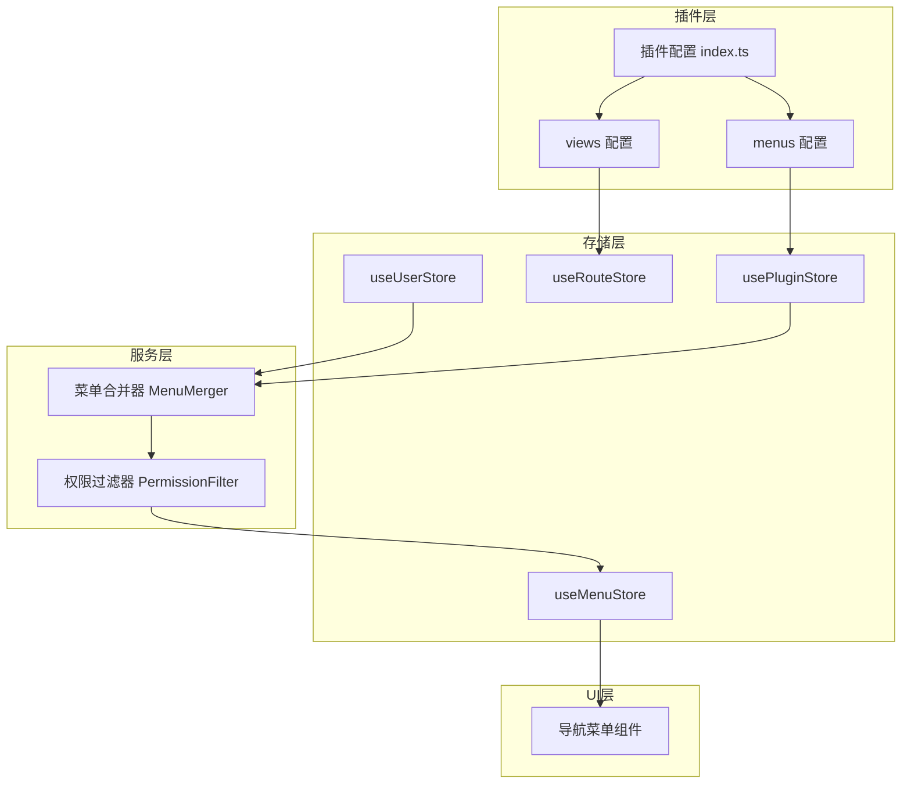
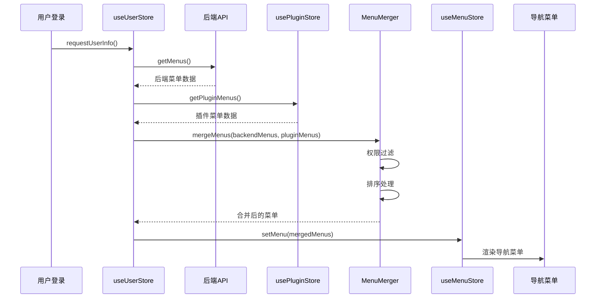

# 设计文档

## 概述

插件前端菜单管理功能通过扩展 MineAdmin 的插件系统，允许插件在前端配置文件中定义菜单结构。系统在初始化时自动收集所有启用插件的菜单定义，并与后端返回的菜单合并，最终渲染到导航栏中。

### 核心特性

- **前端菜单定义**: 插件通过 `menus` 配置定义菜单结构
- **自动菜单合并**: 系统自动合并插件菜单与后端菜单
- **权限控制**: 根据用户权限过滤菜单显示
- **向后兼容**: 保持对后端菜单的完整支持

## 架构

### 整体架构



### 数据流



## 组件和接口

### 类型定义扩展

**Plugin.PluginConfig 扩展**
```typescript
declare namespace Plugin {
  interface PluginConfig {
    install: (app: App) => void
    config: Config
    views?: Views[]
    menus?: PluginMenu[]  // 新增：插件菜单配置
    hooks?: { ... }
  }

  interface PluginMenu {
    name: string                    // 菜单唯一标识
    path: string                    // 路由路径
    component?: string              // 组件路径（可选，用于关联 views）
    redirect?: string               // 重定向路径
    meta: PluginMenuMeta            // 菜单元数据
    children?: PluginMenu[]         // 子菜单
  }

  interface PluginMenuMeta {
    title: string                   // 菜单标题
    i18n?: string                   // 国际化 key
    icon?: string                   // 图标
    type?: 'M' | 'B' | 'I' | 'L'   // 菜单类型：M-菜单 B-按钮 I-iframe L-外链
    hidden?: boolean                // 是否隐藏
    order?: number                  // 排序权重
    auth?: string[]                 // 权限码
    role?: string[]                 // 角色
    cache?: boolean                 // 是否缓存
    affix?: boolean                 // 是否固定标签
    link?: string                   // 外链地址
  }
}
```

### 核心服务

**usePluginStore 扩展**
```typescript
// 新增方法
function getPluginMenus(): Plugin.PluginMenu[] {
  const menus: Plugin.PluginMenu[] = []
  Object.keys(plugins.value).forEach((name: string) => {
    const plugin = plugins.value[name]
    if (plugin.config?.enable && plugin.menus) {
      menus.push(...plugin.menus)
    }
  })
  return menus
}
```

**MenuMerger 服务**
```typescript
interface MenuMerger {
  // 合并后端菜单和插件菜单
  merge(backendMenus: MenuVo[], pluginMenus: Plugin.PluginMenu[]): MineRoute.routeRecord[]
  
  // 权限过滤
  filterByPermission(menus: MineRoute.routeRecord[], permissions: string[], roles: string[]): MineRoute.routeRecord[]
  
  // 排序
  sortMenus(menus: MineRoute.routeRecord[]): MineRoute.routeRecord[]
}
```

### 菜单合并逻辑

```typescript
function mergeMenus(
  backendMenus: MenuVo[], 
  pluginMenus: Plugin.PluginMenu[]
): MineRoute.routeRecord[] {
  // 1. 转换后端菜单为统一格式
  const normalizedBackend = normalizeBackendMenus(backendMenus)
  
  // 2. 转换插件菜单为统一格式
  const normalizedPlugin = normalizePluginMenus(pluginMenus)
  
  // 3. 合并菜单（插件菜单追加到后端菜单后面）
  const merged = [...normalizedBackend, ...normalizedPlugin]
  
  // 4. 按 order 排序
  return sortByOrder(merged)
}

function normalizePluginMenus(menus: Plugin.PluginMenu[]): MineRoute.routeRecord[] {
  return menus.map(menu => ({
    name: menu.name,
    path: menu.path,
    redirect: menu.redirect,
    meta: {
      title: menu.meta.title,
      i18n: menu.meta.i18n,
      icon: menu.meta.icon,
      type: menu.meta.type || 'M',
      hidden: menu.meta.hidden || false,
      auth: menu.meta.auth,
      role: menu.meta.role,
      cache: menu.meta.cache,
      affix: menu.meta.affix,
      link: menu.meta.link,
      order: menu.meta.order || 100,
    },
    children: menu.children ? normalizePluginMenus(menu.children) : undefined,
  }))
}
```

### 权限过滤逻辑

```typescript
function filterByPermission(
  menus: MineRoute.routeRecord[],
  userPermissions: string[],
  userRoles: string[]
): MineRoute.routeRecord[] {
  return menus.filter(menu => {
    // 超级管理员跳过权限检查
    if (userRoles.includes('SuperAdmin')) return true
    
    // 检查权限码
    if (menu.meta?.auth?.length) {
      const hasPermission = menu.meta.auth.some(p => userPermissions.includes(p))
      if (!hasPermission) return false
    }
    
    // 检查角色
    if (menu.meta?.role?.length) {
      const hasRole = menu.meta.role.some(r => userRoles.includes(r))
      if (!hasRole) return false
    }
    
    // 递归过滤子菜单
    if (menu.children) {
      menu.children = filterByPermission(menu.children, userPermissions, userRoles)
    }
    
    return true
  })
}
```

## 数据模型

### 插件菜单配置示例

```typescript
// web/src/plugins/since/system-message/index.ts
const pluginConfig: Plugin.PluginConfig = {
  install(_app: App) {},
  config: {
    enable: true,
    info: {
      name: 'since/system-message',
      version: '1.0.0',
      author: 'Since Team',
      description: '系统消息通知管理插件',
      order: 100
    },
  },
  // 菜单配置
  menus: [
    {
      name: 'plugin:system:message',
      path: '/admin/system-message',
      redirect: '/admin/system-message/list',
      meta: {
        title: '消息管理',
        i18n: 'plugin.systemMessage.title',
        icon: 'ep:message',
        type: 'M',
        order: 100,
      },
      children: [
        {
          name: 'plugin:system:message:list',
          path: '/admin/system-message/list',
          component: 'since/system-message/views/admin/AdminMessageList',
          meta: {
            title: '消息列表',
            i18n: 'plugin.systemMessage.list',
            icon: 'ep:list',
            type: 'M',
            auth: ['system-message:index'],
          },
        },
        {
          name: 'plugin:system:message:statistics',
          path: '/admin/system-message/statistics',
          component: 'since/system-message/views/admin/AdminDashboard',
          meta: {
            title: '消息统计',
            i18n: 'plugin.systemMessage.statistics',
            icon: 'ep:data-analysis',
            type: 'M',
            auth: ['system-message:statistics'],
          },
        },
        {
          name: 'plugin:system:message:settings',
          path: '/admin/system-message/settings',
          component: 'since/system-message/views/NotificationSettings',
          meta: {
            title: '消息设置',
            i18n: 'plugin.systemMessage.settings',
            icon: 'ep:setting',
            type: 'M',
            auth: ['system-message:admin'],
          },
        },
      ],
    },
  ],
  // 路由配置（保持现有结构）
  views: [
    {
      name: 'AdminMessageList',
      path: '/admin/system-message/list',
      meta: { title: '消息列表' },
      component: () => import('./views/admin/AdminMessageList.vue')
    },
    // ...
  ],
}
```

## 正确性属性

*属性是一个特征或行为，应该在系统的所有有效执行中保持为真——本质上是关于系统应该做什么的正式声明。属性作为人类可读规范和机器可验证正确性保证之间的桥梁。*

### 属性 1：菜单定义完整性
*对于任何*有效的插件菜单配置，系统应能够正确解析包含任意深度嵌套、各种元数据组合和国际化配置的菜单结构
**验证需求：需求 1.1, 1.2, 1.3, 1.4**

### 属性 2：菜单合并正确性
*对于任何*后端菜单列表和插件菜单列表的组合，合并后的菜单应包含两者的所有菜单项，且不丢失任何数据
**验证需求：需求 2.1, 2.2**

### 属性 3：菜单排序正确性
*对于任何*带有 order 属性的菜单列表，排序后的菜单应按 order 值升序排列
**验证需求：需求 2.3**

### 属性 4：插件禁用菜单移除
*对于任何*被禁用的插件，其定义的菜单不应出现在最终的菜单列表中
**验证需求：需求 2.4, 5.3**

### 属性 5：权限过滤正确性
*对于任何*带有权限配置的菜单和用户权限组合，过滤后的菜单应只包含用户有权限访问的菜单项
**验证需求：需求 3.1, 3.3**

### 属性 6：菜单路由关联
*对于任何*定义了 component 的菜单项，系统应能够正确关联到对应的路由组件
**验证需求：需求 4.1**

### 属性 7：外链菜单支持
*对于任何*类型为 'L' 且定义了 link 的菜单项，系统应将其识别为外链而非内部路由
**验证需求：需求 4.4**

### 属性 8：格式兼容性
*对于任何*符合后端菜单格式的插件菜单配置，系统应能够正确处理并渲染
**验证需求：需求 6.2**

## 错误处理

### 错误类型

1. **配置错误**: 插件菜单配置格式不正确
   - 开发模式下在控制台输出警告
   - 跳过无效的菜单配置

2. **组件未找到**: 菜单引用的组件不存在
   - 开发模式下在控制台输出警告
   - 菜单仍然显示，点击时显示 404 页面

3. **权限配置错误**: 权限码格式不正确
   - 视为无权限限制，正常显示菜单

## 测试策略

### 单元测试

- 测试菜单合并逻辑
- 测试权限过滤逻辑
- 测试排序逻辑
- 测试菜单格式转换

### 属性测试

使用 fast-check 库进行属性测试：
- 每个属性测试最少运行 100 次迭代
- 测试标记格式: `**功能: plugin-frontend-menu, 属性 {编号}: {属性文本}**`

### 集成测试

- 测试插件启用/禁用时菜单的动态变化
- 测试与后端菜单的兼容性
- 测试路由导航功能
