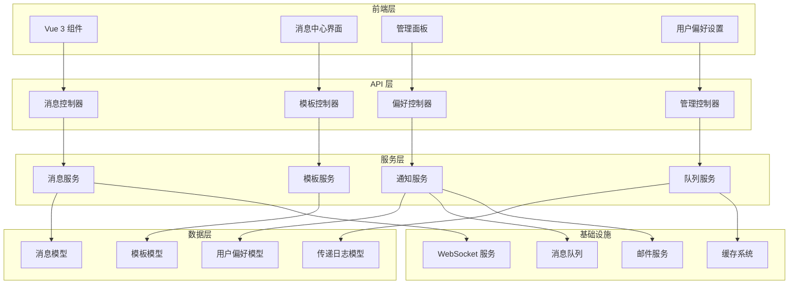

# 设计文档

## 概述

系统消息插件是一个为 MineAdmin 平台设计的综合性消息通知系统。该插件采用现代化的架构设计，支持多种消息类型、传递渠道和用户偏好设置。插件遵循 MineAdmin 的标准插件结构，提供完整的前后端解决方案。

### 核心特性

- **多渠道消息传递**: 支持站内信、邮件、短信等多种传递方式
- **实时通知**: 基于 WebSocket 的实时消息推送
- **消息模板系统**: 支持变量替换的可重用消息模板
- **用户偏好管理**: 个性化的通知设置和免打扰功能
- **管理仪表板**: 完整的消息管理和统计分析界面
- **扩展性设计**: 为未来的小程序推送等功能预留接口

## 架构

### 整体架构



### 插件结构

按照 MineAdmin 标准插件结构组织：

```
plugin/since/system-message/
├── mine.json                    # 插件配置文件
├── README.md                    # 说明文档
├── src/                         # 后端源码
│   ├── ConfigProvider.php       # 配置提供者
│   ├── InstallScript.php        # 安装脚本
│   ├── UninstallScript.php      # 卸载脚本
│   ├── Controller/              # 控制器
│   ├── Service/                 # 服务层
│   ├── Repository/              # 仓库层
│   ├── Model/                   # 模型
│   ├── Request/                 # 请求验证
│   ├── Middleware/              # 中间件
│   ├── Command/                 # 命令行
│   ├── Listener/                # 事件监听器
│   └── Exception/               # 异常处理
├── web/                         # 前端源码
│   ├── views/                   # 页面组件
│   ├── components/              # 公共组件
│   ├── api/                     # API 接口
│   ├── store/                   # 状态管理
│   └── assets/                  # 静态资源
├── Database/                    # 数据库
│   ├── Migrations/              # 迁移文件
│   └── Seeders/                 # 数据填充
└── config/                      # 配置文件
```

## 组件和接口

### 后端组件

#### 1. 核心服务类

**MessageService (消息服务)**
```php
class MessageService
{
    public function create(array $data): Message
    public function send(int $messageId): bool
    public function schedule(int $messageId, Carbon $scheduledAt): bool
    public function getByUser(int $userId, array $filters = []): Collection
    public function markAsRead(int $messageId, int $userId): bool
    public function delete(int $messageId, int $userId): bool
}
```

**TemplateService (模板服务)**
```php
class TemplateService
{
    public function create(array $data): MessageTemplate
    public function render(int $templateId, array $variables): string
    public function preview(int $templateId, array $variables): string
    public function validate(int $templateId, array $variables): bool
}
```

**NotificationService (通知服务)**
```php
class NotificationService
{
    public function notify(Message $message, User $user): bool
    public function sendRealtime(Message $message, User $user): bool
    public function sendEmail(Message $message, User $user): bool
    public function sendSms(Message $message, User $user): bool
}
```

#### 2. 控制器

**MessageController (消息控制器)**
- `GET /admin/system-message/messages` - 获取消息列表
- `POST /admin/system-message/messages` - 创建消息
- `PUT /admin/system-message/messages/{id}` - 更新消息
- `DELETE /admin/system-message/messages/{id}` - 删除消息
- `POST /admin/system-message/messages/{id}/send` - 发送消息

**UserMessageController (用户消息控制器)**
- `GET /api/system-message/messages` - 获取用户消息
- `PUT /api/system-message/messages/{id}/read` - 标记已读
- `DELETE /api/system-message/messages/{id}` - 删除消息

#### 3. 中间件

**MessagePermissionMiddleware**
- 验证用户对消息的访问权限
- 检查消息的可见性设置

### 前端组件

#### 1. 核心 Vue 组件

**MessageCenter.vue (消息中心)**
```vue
<template>
  <div class="message-center">
    <message-list :messages="messages" @read="markAsRead" />
    <message-detail v-if="selectedMessage" :message="selectedMessage" />
  </div>
</template>
```

**MessageNotification.vue (消息通知)**
```vue
<template>
  <div class="message-notification">
    <el-badge :value="unreadCount" class="notification-badge">
      <el-button @click="toggleMessageCenter">
        <el-icon><Bell /></el-icon>
      </el-button>
    </el-badge>
  </div>
</template>
```

**AdminMessageManager.vue (管理面板)**
```vue
<template>
  <div class="admin-message-manager">
    <message-form @submit="createMessage" />
    <message-list :messages="allMessages" admin-mode />
    <message-statistics :stats="statistics" />
  </div>
</template>
```

#### 2. API 接口

**messageApi.ts**
```typescript
export interface MessageApi {
  getMessages(params: MessageQuery): Promise<MessageResponse>
  createMessage(data: CreateMessageRequest): Promise<Message>
  sendMessage(id: number): Promise<void>
  markAsRead(id: number): Promise<void>
  deleteMessage(id: number): Promise<void>
}
```

## 数据模型

### 数据库表设计

#### 1. 消息表 (system_messages)

```sql
CREATE TABLE system_messages (
    id BIGINT UNSIGNED AUTO_INCREMENT PRIMARY KEY,
    title VARCHAR(255) NOT NULL COMMENT '消息标题',
    content TEXT NOT NULL COMMENT '消息内容',
    type ENUM('system', 'announcement', 'alert', 'reminder') DEFAULT 'system' COMMENT '消息类型',
    priority TINYINT DEFAULT 1 COMMENT '优先级 1-5',
    sender_id BIGINT UNSIGNED COMMENT '发送者ID',
    recipient_type ENUM('all', 'role', 'user') DEFAULT 'all' COMMENT '收件人类型',
    recipient_ids JSON COMMENT '收件人ID列表',
    template_id BIGINT UNSIGNED COMMENT '模板ID',
    template_variables JSON COMMENT '模板变量',
    channels JSON COMMENT '传递渠道',
    scheduled_at TIMESTAMP NULL COMMENT '计划发送时间',
    sent_at TIMESTAMP NULL COMMENT '实际发送时间',
    status ENUM('draft', 'scheduled', 'sending', 'sent', 'failed') DEFAULT 'draft' COMMENT '状态',
    created_by BIGINT UNSIGNED COMMENT '创建者',
    updated_by BIGINT UNSIGNED COMMENT '更新者',
    created_at TIMESTAMP DEFAULT CURRENT_TIMESTAMP,
    updated_at TIMESTAMP DEFAULT CURRENT_TIMESTAMP ON UPDATE CURRENT_TIMESTAMP,
    deleted_at TIMESTAMP NULL,
    remark VARCHAR(255) DEFAULT '' COMMENT '备注',
    
    INDEX idx_type (type),
    INDEX idx_status (status),
    INDEX idx_scheduled_at (scheduled_at),
    INDEX idx_created_at (created_at)
) COMMENT='系统消息表';
```

#### 2. 用户消息关联表 (user_messages)

```sql
CREATE TABLE user_messages (
    id BIGINT UNSIGNED AUTO_INCREMENT PRIMARY KEY,
    user_id BIGINT UNSIGNED NOT NULL COMMENT '用户ID',
    message_id BIGINT UNSIGNED NOT NULL COMMENT '消息ID',
    is_read BOOLEAN DEFAULT FALSE COMMENT '是否已读',
    read_at TIMESTAMP NULL COMMENT '阅读时间',
    is_deleted BOOLEAN DEFAULT FALSE COMMENT '是否删除',
    deleted_at TIMESTAMP NULL COMMENT '删除时间',
    created_at TIMESTAMP DEFAULT CURRENT_TIMESTAMP,
    
    UNIQUE KEY uk_user_message (user_id, message_id),
    INDEX idx_user_id (user_id),
    INDEX idx_message_id (message_id),
    INDEX idx_is_read (is_read)
) COMMENT='用户消息关联表';
```

#### 3. 消息模板表 (message_templates)

```sql
CREATE TABLE message_templates (
    id BIGINT UNSIGNED AUTO_INCREMENT PRIMARY KEY,
    name VARCHAR(100) NOT NULL COMMENT '模板名称',
    title VARCHAR(255) NOT NULL COMMENT '消息标题模板',
    content TEXT NOT NULL COMMENT '消息内容模板',
    type ENUM('system', 'announcement', 'alert', 'reminder') DEFAULT 'system' COMMENT '消息类型',
    format ENUM('text', 'html', 'markdown') DEFAULT 'text' COMMENT '内容格式',
    variables JSON COMMENT '可用变量列表',
    is_active BOOLEAN DEFAULT TRUE COMMENT '是否启用',
    created_by BIGINT UNSIGNED COMMENT '创建者',
    updated_by BIGINT UNSIGNED COMMENT '更新者',
    created_at TIMESTAMP DEFAULT CURRENT_TIMESTAMP,
    updated_at TIMESTAMP DEFAULT CURRENT_TIMESTAMP ON UPDATE CURRENT_TIMESTAMP,
    deleted_at TIMESTAMP NULL,
    remark VARCHAR(255) DEFAULT '' COMMENT '备注',
    
    INDEX idx_type (type),
    INDEX idx_is_active (is_active)
) COMMENT='消息模板表';
```

#### 4. 用户通知偏好表 (user_notification_preferences)

```sql
CREATE TABLE user_notification_preferences (
    id BIGINT UNSIGNED AUTO_INCREMENT PRIMARY KEY,
    user_id BIGINT UNSIGNED NOT NULL COMMENT '用户ID',
    message_type ENUM('system', 'announcement', 'alert', 'reminder') NOT NULL COMMENT '消息类型',
    channels JSON COMMENT '启用的传递渠道',
    is_enabled BOOLEAN DEFAULT TRUE COMMENT '是否启用',
    do_not_disturb_start TIME COMMENT '免打扰开始时间',
    do_not_disturb_end TIME COMMENT '免打扰结束时间',
    created_at TIMESTAMP DEFAULT CURRENT_TIMESTAMP,
    updated_at TIMESTAMP DEFAULT CURRENT_TIMESTAMP ON UPDATE CURRENT_TIMESTAMP,
    
    UNIQUE KEY uk_user_type (user_id, message_type),
    INDEX idx_user_id (user_id)
) COMMENT='用户通知偏好表';
```

#### 5. 消息传递日志表 (message_delivery_logs)

```sql
CREATE TABLE message_delivery_logs (
    id BIGINT UNSIGNED AUTO_INCREMENT PRIMARY KEY,
    message_id BIGINT UNSIGNED NOT NULL COMMENT '消息ID',
    user_id BIGINT UNSIGNED NOT NULL COMMENT '用户ID',
    channel ENUM('websocket', 'email', 'sms', 'miniapp') NOT NULL COMMENT '传递渠道',
    status ENUM('pending', 'sent', 'delivered', 'failed') DEFAULT 'pending' COMMENT '传递状态',
    attempt_count TINYINT DEFAULT 0 COMMENT '尝试次数',
    error_message TEXT COMMENT '错误信息',
    sent_at TIMESTAMP NULL COMMENT '发送时间',
    delivered_at TIMESTAMP NULL COMMENT '送达时间',
    created_at TIMESTAMP DEFAULT CURRENT_TIMESTAMP,
    updated_at TIMESTAMP DEFAULT CURRENT_TIMESTAMP ON UPDATE CURRENT_TIMESTAMP,
    
    INDEX idx_message_id (message_id),
    INDEX idx_user_id (user_id),
    INDEX idx_channel (channel),
    INDEX idx_status (status)
) COMMENT='消息传递日志表';
```

### 模型关系

```php
// Message 模型
class Message extends Model
{
    public function sender(): BelongsTo
    public function template(): BelongsTo
    public function userMessages(): HasMany
    public function deliveryLogs(): HasMany
    public function recipients(): Collection // 动态计算收件人
}

// UserMessage 模型
class UserMessage extends Model
{
    public function user(): BelongsTo
    public function message(): BelongsTo
}

// MessageTemplate 模型
class MessageTemplate extends Model
{
    public function messages(): HasMany
    public function render(array $variables): string
}
```

## 正确性属性

*属性是一个特征或行为，应该在系统的所有有效执行中保持为真——本质上是关于系统应该做什么的正式声明。属性作为人类可读规范和机器可验证正确性保证之间的桥梁。*

基于需求分析，以下是系统消息插件的核心正确性属性：

### 属性 1：消息创建验证
*对于任何*消息创建请求，如果缺少必需字段（标题、内容、收件人），则应该被拒绝并返回验证错误
**验证需求：需求 2.1**

### 属性 2：收件人类型处理
*对于任何*消息，系统应该能够正确处理所有收件人类型（全部用户、特定角色、个人用户）并生成正确的收件人列表
**验证需求：需求 2.2**

### 属性 3：消息调度
*对于任何*设置了未来发送时间的消息，系统应该在指定时间之前不发送该消息
**验证需求：需求 2.3**

### 属性 4：消息历史记录
*对于任何*消息编辑操作，系统应该保留完整的变更历史记录
**验证需求：需求 2.4**

### 属性 5：模板变量替换往返
*对于任何*有效的消息模板和变量集合，渲染模板后应该包含所有提供的变量值
**验证需求：需求 2.5**

### 属性 6：消息分类
*对于任何*创建的消息，系统应该根据指定的类型正确分类消息
**验证需求：需求 2.6**

### 属性 7：实时通知传递
*对于任何*在线用户，当有新消息时应该通过 WebSocket 接收到实时通知
**验证需求：需求 3.1**

### 属性 8：离线消息存储
*对于任何*离线用户，发送给他们的消息应该被存储并在他们上线时可用
**验证需求：需求 3.2**

### 属性 9：用户偏好遵循
*对于任何*消息传递，系统应该根据用户的通知偏好选择合适的传递渠道
**验证需求：需求 3.3**

### 属性 10：重试机制
*对于任何*传递失败的消息，系统应该根据配置的重试策略进行重试
**验证需求：需求 3.4**

### 属性 11：消息列表过滤
*对于任何*消息列表请求，系统应该根据提供的过滤条件返回正确的消息子集
**验证需求：需求 4.1**

### 属性 12：消息状态显示
*对于任何*消息，系统应该正确显示其状态（已读/未读、优先级等）
**验证需求：需求 4.2**

### 属性 13：消息操作
*对于任何*消息操作（标记已读、删除、归档），系统应该正确更新消息状态
**验证需求：需求 4.3**

### 属性 14：实时通知显示
*对于任何*新消息，系统应该向相关用户显示实时通知
**验证需求：需求 4.4**

### 属性 15：搜索功能
*对于任何*搜索查询，系统应该返回包含查询关键词的所有相关消息
**验证需求：需求 4.5**

### 属性 16：分页功能
*对于任何*分页请求，系统应该返回正确的页面数据和总数信息
**验证需求：需求 4.6**

### 属性 17：模板变量支持
*对于任何*消息模板，系统应该正确识别和处理所有变量占位符
**验证需求：需求 5.1**

### 属性 18：模板使用往返
*对于任何*模板和变量组合，使用模板创建消息后应该包含所有替换后的内容
**验证需求：需求 5.2**

### 属性 19：模板 CRUD 操作
*对于任何*模板管理操作，系统应该正确执行创建、读取、更新、删除操作
**验证需求：需求 5.3**

### 属性 20：模板格式支持
*对于任何*支持的格式（文本、HTML、Markdown），系统应该正确处理和渲染内容
**验证需求：需求 5.4**

### 属性 21：模板预览
*对于任何*模板预览请求，系统应该返回渲染后的内容而不实际发送消息
**验证需求：需求 5.5**

### 属性 22：偏好配置
*对于任何*用户偏好配置，系统应该为每种消息类型正确保存传递渠道选择
**验证需求：需求 6.1**

### 属性 23：免打扰功能
*对于任何*设置了免打扰时间的用户，系统应该在指定时间段内不发送通知
**验证需求：需求 6.2**

### 属性 24：偏好精细控制
*对于任何*用户偏好设置，系统应该提供对所有消息类别的独立控制
**验证需求：需求 6.3**

### 属性 25：偏好持久化
*对于任何*用户偏好更改，系统应该在所有会话和设备间保持一致
**验证需求：需求 6.4**

### 属性 26：默认偏好设置
*对于任何*新用户，系统应该自动创建合理的默认通知偏好
**验证需求：需求 6.5**

### 属性 27：消息监控
*对于任何*消息，管理员应该能够查看其传递状态和失败原因
**验证需求：需求 7.2**

### 属性 28：批量消息
*对于任何*批量消息操作，系统应该正确处理所有目标用户
**验证需求：需求 7.3**

### 属性 29：消息调度管理
*对于任何*调度消息，管理员应该能够查看、修改或取消调度
**验证需求：需求 7.4**

### 属性 30：审计日志
*对于任何*消息相关操作，系统应该记录完整的审计日志
**验证需求：需求 7.5**

### 属性 31：事件驱动消息
*对于任何*系统事件，如果配置了相应的消息触发器，系统应该自动发送消息
**验证需求：需求 8.2**

### 属性 32：API 身份验证
*对于任何*API 访问，系统应该验证用户身份和权限
**验证需求：需求 8.3**

### 属性 33：Webhook 支持
*对于任何*配置的 webhook，系统应该在相应事件发生时正确调用
**验证需求：需求 8.4**

### 属性 34：批处理功能
*对于任何*批量操作，系统应该能够高效处理而不影响单个操作的性能
**验证需求：需求 9.3**

### 属性 35：敏感内容加密
*对于任何*标记为敏感的消息内容，系统应该在存储前进行加密
**验证需求：需求 10.1**

### 属性 36：访问控制
*对于任何*消息访问请求，系统应该根据用户角色和权限控制访问
**验证需求：需求 10.2**

### 属性 37：日志安全
*对于任何*日志记录，系统应该排除敏感信息
**验证需求：需求 10.3**

### 属性 38：数据保留策略
*对于任何*消息，系统应该根据配置的保留策略自动清理过期数据
**验证需求：需求 10.4**

### 属性 39：输入验证
*对于任何*用户输入，系统应该验证和清理以防止安全漏洞
**验证需求：需求 10.5**

## 错误处理

### 错误类型定义

```php
namespace Plugin\Since\SystemMessage\Exception;

class MessageException extends BusinessException
{
    public const MESSAGE_NOT_FOUND = 40001;
    public const INVALID_RECIPIENT = 40002;
    public const TEMPLATE_RENDER_ERROR = 40003;
    public const DELIVERY_FAILED = 40004;
    public const PERMISSION_DENIED = 40005;
}
```

### 错误处理策略

1. **验证错误**: 返回详细的验证错误信息
2. **业务逻辑错误**: 返回用户友好的错误消息
3. **系统错误**: 记录详细日志，返回通用错误消息
4. **网络错误**: 实现重试机制和降级策略

## 测试策略

### 双重测试方法

系统消息插件将采用单元测试和基于属性的测试相结合的方法：

**单元测试**：
- 验证特定示例和边界情况
- 测试组件间的集成点
- 验证错误条件和异常处理

**基于属性的测试**：
- 验证跨所有输入的通用属性
- 通过随机化提供全面的输入覆盖
- 每个属性测试最少运行 100 次迭代

### 测试配置

**基于属性的测试库**: 使用 PHP 的 Eris 库进行基于属性的测试

**测试标记格式**: 每个属性测试必须包含注释引用其设计文档属性
- 格式: `**功能: system-message-plugin, 属性 {编号}: {属性文本}**`

**测试覆盖范围**：
- 所有核心业务逻辑
- API 端点和数据验证
- 消息传递和通知机制
- 用户权限和安全控制
- 模板渲染和变量替换

### 测试环境

- **开发环境**: 完整的测试套件，包括集成测试
- **CI/CD 环境**: 自动化测试，包括性能基准测试
- **生产环境**: 健康检查和监控测试